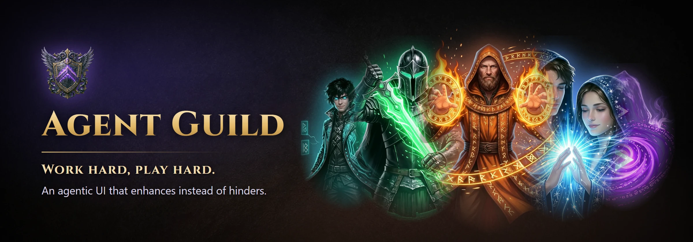
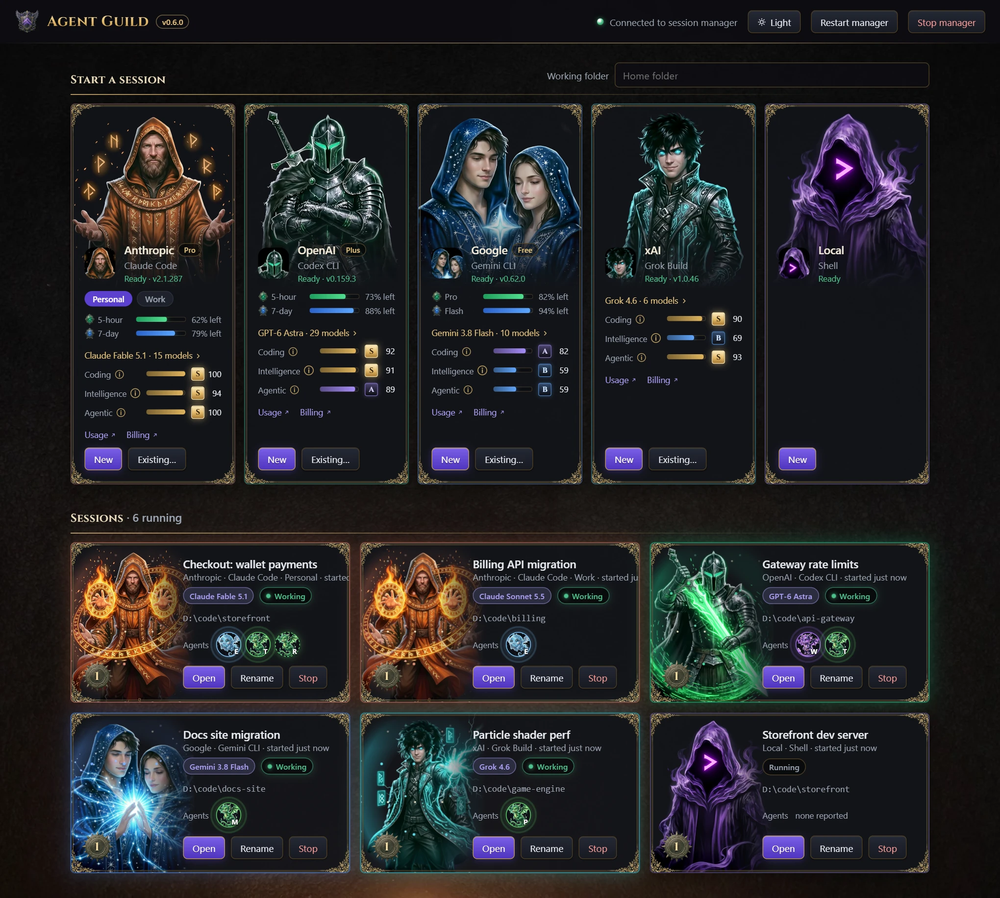
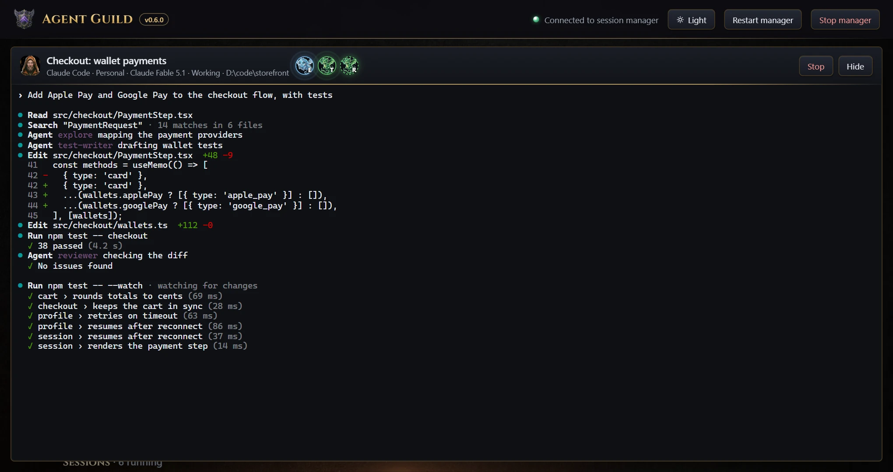
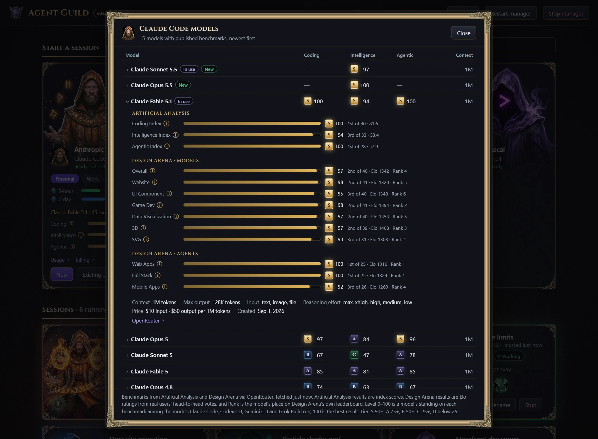
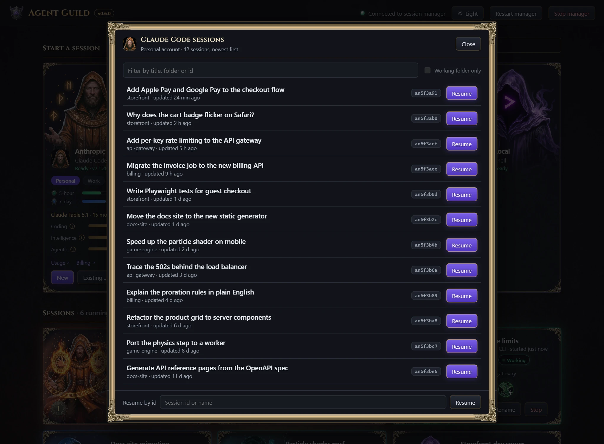
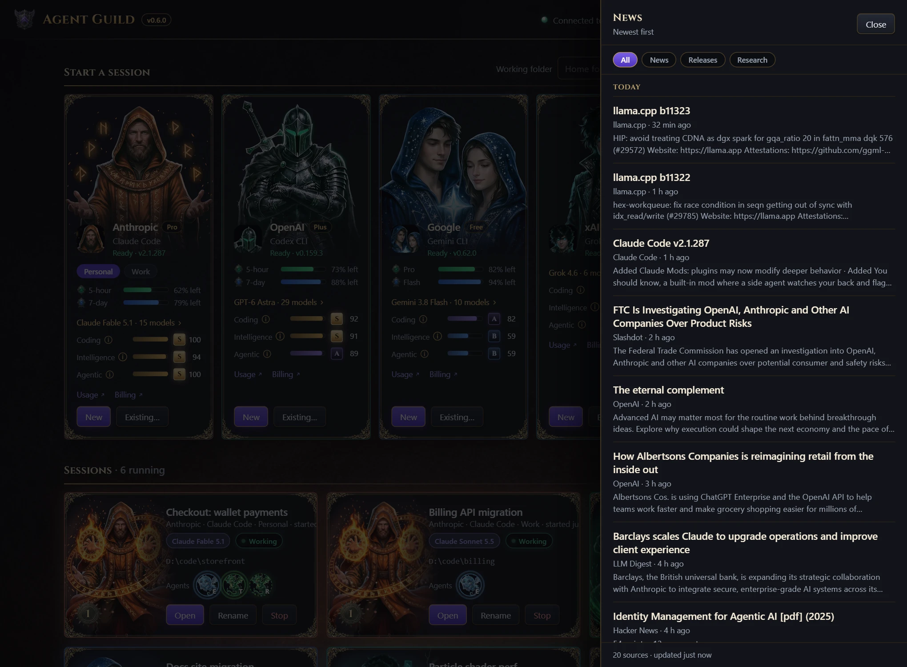
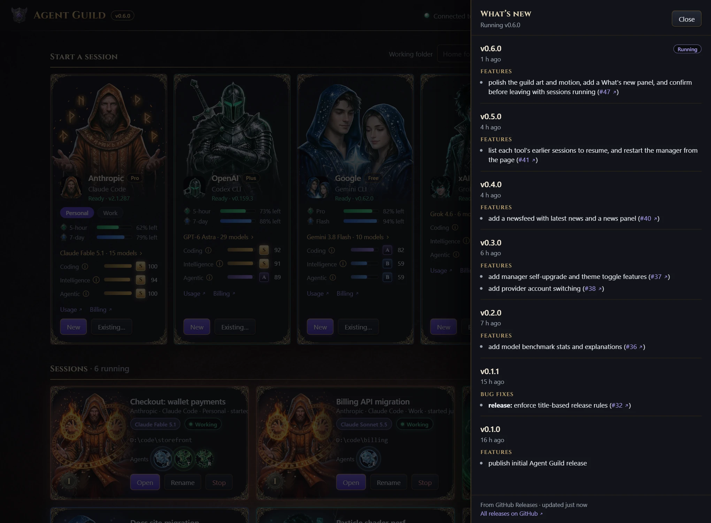

<p align="center">
  
</p>

<p align="center">
  <a href="https://www.npmjs.com/package/@oddessentials/agent-guild"></a>
  <a href="https://github.com/oddessentials/agent-guild/actions/workflows/release.yml"></a>
  
  
  <a href="LICENSE"></a>
  <a href="https://www.youtube.com/watch?v=ziT62WtXQ1M"></a>
</p>

**Agent Guild** runs Claude Code, Codex CLI, Gemini CLI, Grok Build and your
own shell side by side, in real terminals, from one local web page. Each
session is a card that shows what the tool is doing, which model it runs and
which helper agents it has summoned. Close the page whenever you like; the
sessions keep working.

See it in action in the [Agent Guild trailer](https://www.youtube.com/watch?v=ziT62WtXQ1M).

<picture>
  <source media="(prefers-color-scheme: light)" srcset="docs/images/overview-light.webp">
  
</picture>

## Quick start

```sh
npm install -g @oddessentials/agent-guild
agent-guild
```

The page opens in your browser. Pick a provider, press **New**, and you are
in a live terminal.

**You need** Node.js 22 or newer on Windows 10 1809+, macOS 11+ or Linux
(x64 or arm64), and each coding tool you want to use, signed in on its own.
Agent Guild installs the tools for you but never handles your sign-in. No
compiler and no WSL are needed.

## Features

**Every major coding CLI, one place.** Claude Code, Codex CLI, Gemini CLI,
Grok Build and a plain shell each get a card. A tool that is missing shows
**Install**, which runs the install in a session you can watch. An installed
tool shows its version and offers **Update** when a newer one is out, using
the same installer that put it there: npm, Homebrew, WinGet or the vendor's
own.

**Real terminals that outlive the page.** Every session is a full interactive
terminal: type instructions, answer prompts, watch output. Run as many as you
like. A local session manager owns them, so you can close or reload the page
and come back to the same screens.



**Agents and models at work.** Helper agents that a tool starts appear on its
card as familiars while they run, and the card names the model in use. The
character comes alive while the session works, and the session's level rises
with every hour it runs.

**Several subscriptions per tool.** Add a work account next to your personal
one and switch with a chip on the card. Each account keeps its own sign-in,
usage meters and sessions. See [Accounts](docs/configuration.md#accounts).

**See what is left of your limits.** Claude Code, Codex CLI and Gemini CLI
cards show a meter for each rate-limit window, such as 5-hour and 7-day, with
the time until it resets. They also show your plan, Claude's extra-usage
spend and Codex's credit balance when the account has them. Any other tool
can supply a command that prints its usage.

**Pick the right model.** Each card grades the tool's newest fully
benchmarked model on coding, intelligence and agentic work, from S to D. Open it to compare every
model the tool offers across 13 benchmarks: Artificial Analysis indexes and
Design Arena results for websites, UI, game dev, data visualization, 3D, SVG,
web apps, full stack and mobile. It also shows context size and price.



**Pick up where you left off.** **Existing…** lists the tool's own earlier
sessions, newest first, read from where the tool keeps them. Filter by title,
folder or id and resume one in its own folder, or resume any session by id.



**Agentic development news.** A newsfeed gathers about 20 sources on AI
coding, agents and local models, including vendor blogs, Hacker News, arXiv,
and releases of the tools you have installed. The five latest headlines
appear on the page; **All news** opens the full feed with News, Releases and Research
filters.



**Always current.** When a new Agent Guild is published, **Upgrade to
vX.Y.Z** installs it while your sessions keep running, and **Restart to use
vX.Y.Z** switches over when you are ready. The version badge opens
**What's new** with the notes of every release.



**Appearance.** The Appearance menu in the top bar picks a skin and light or
dark mode, without a reload. **Guild** is the default fantasy look;
**Professional** is a plain business look with no characters; **Orbital**
puts a crew of little robots in deep space; **Grove** is a calm moss garden
of gentle nature spirits. The page
follows your system's light or dark setting until you pick one. See
[docs/SKINS.md](docs/SKINS.md) to make another.

**Yard.** The View control in the top bar switches between the card page and
an isometric guild yard, without a reload. Halls are the tools and heroes are
the sessions. Working heroes pace, and the agents they summon stand with
them. Every command is the one on the card: new, existing, install, the
terminal, news and GitHub. The choice is remembered on this browser. Skins
and light or dark mode still apply to the frame around the yard.

## Commands

| Command | What it does |
| --- | --- |
| `agent-guild` or `agent-guild open` | Start the manager if needed and open the page. `--no-browser` prints the URL instead. |
| `agent-guild status` | Show whether the manager is running and list its sessions. |
| `agent-guild stop` | Stop the manager, ending every session. |
| `agent-guild restart` | Stop the manager and start it again on the version installed on disk, ending every session. |
| `agent-guild url` | Print the page URL with its access token. |
| `agent-guild start` | Run the manager in the foreground, for debugging. |

The page's **Restart manager** and **Stop manager** buttons do the same as
`restart` and `stop`, but ask first while sessions are running. The page also
asks before you close it with sessions running. Sessions end when the manager
stops or the computer restarts.

## Configuration

Nothing needs configuring. To add a provider, change a command, sign in with
more than one account or point usage meters at your own command, create a
`providers.json` in the data folder:

| Platform | Data folder |
| --- | --- |
| Windows | `%APPDATA%\AgentGuild` |
| macOS | `~/Library/Application Support/AgentGuild` |
| Linux | `~/.config/agent-guild` |

The full reference, including every field and environment variable, is in
[docs/configuration.md](docs/configuration.md).

## Show agents and models

Agents are reported by the coding tool's hooks, not guessed from its output.
Each helper agent appears on the card while it runs. Agent Guild gives every
Claude Code and Codex CLI session its reporting hooks for that session only,
without changing the tool's own settings. Gemini CLI has no such option: turn
on **Agent reporting** on its card once, which links an Agent Guild extension
into Gemini. Grok Build cannot take hooks for one session yet; add the hooks
from [examples/grok-hooks.json](examples/grok-hooks.json) to see its agents.
When a tool's hooks do not run, because hooks are turned off, restricted by
an administrator or not trusted for the folder, the card says so.

The card also names the model, from the hooks, from `--model` or from the
tool's screen.

Any other tool or script can report agents and its model too. See
[docs/agent-reporting.md](docs/agent-reporting.md).

## Security and privacy

* The manager listens on `127.0.0.1` only.
* Every API call needs a random per-user token, stored in the data folder
  with owner-only permissions. Anyone who can run programs as your user can
  read it, as with any local developer tool.
* Requests with a foreign `Host` or `Origin` header are refused, so other
  websites cannot reach your terminals through your browser.
* Tools inside a session get a separate token that can only report agents
  for that session.
* GitHub sign-ins, the SSH key Agent Guild makes for each GitHub account and
  GitHub's SSH host keys are kept in the `github` folder of the data folder,
  readable only by you. A clone uses only that key and those host keys; your
  own `~/.ssh` and Git configuration are not read or changed.
* Usage meters are fetched by the manager with each tool's own sign-in. The
  page only receives percentages. On macOS the first lookup may ask for
  keychain access to the "Claude Code-credentials" and "gemini-cli-oauth"
  items; choose Always Allow.

The manager makes these outbound requests, and none of them carry your code
or prompts:

| To | For | How often |
| --- | --- | --- |
| npm registry | Tool and Agent Guild version checks | About hourly; `AGENT_GUILD_NO_UPDATE_CHECK=1` turns them off |
| Anthropic, OpenAI and Google usage endpoints | Usage meters, with the tool's own sign-in | Every minute while the page is open |
| OpenRouter's public model list | Benchmarks | Every 6 hours |
| Public news feeds, Hacker News, arXiv and GitHub | The newsfeed | Every 30 minutes while the page is open |
| GitHub's releases API | What's new | Hourly |
| GitHub (sign-in, API, avatars and SSH) | Signing in to GitHub, listing your repositories, adding your SSH key and cloning | When you use **Clone from GitHub…** |

## Other front ends

The page is one client of the manager's local API, documented in
[docs/api.md](docs/api.md). Another interface, such as a planned Unreal Engine
guild hall, can drive the same sessions at the same time. See
[docs/architecture.md](docs/architecture.md).

## Development

```sh
git clone https://github.com/oddessentials/agent-guild.git
cd agent-guild
npm install
npm start      # open the page, starting a manager from this checkout if none runs
npm test
```

* The tests start real managers and real pseudo-terminals, using a small fake
  coding tool in `tests/fixtures`. CI runs them on Windows, macOS and Linux
  with Node.js 22, 24 and 26, and installs the packed package on x64 and
  arm64.
* In a checkout, `launchers/AgentGuild.cmd` (Windows) and
  `launchers/AgentGuild.command` (macOS) start Agent Guild with a
  double-click.
* `node docs/capture/capture.mjs --root <folder>` refreshes the screenshots
  in `docs/images` from the real page, with demo sessions in place of real
  tools. The cards show the folder's path, so pick a neutral one such as
  `D:\code` or `/work`. It needs Chrome or Edge and leaves any running
  manager alone. See the comment at the top of the script for options.
* Pull request titles follow
  [Conventional Commits](https://www.conventionalcommits.org/). Merging to
  `main` publishes a release to npm and GitHub when it includes a `feat`,
  `fix`, `perf` or `revert`.

## Current limits

* Sessions end when the manager stops or the computer restarts.
* Grok Build has no usage meter.
* Gemini CLI usage meters read its sign-in where Gemini CLI keeps it:
  `oauth_creds.json`, or with `GEMINI_FORCE_ENCRYPTED_FILE_STORAGE=true` the
  OS keychain (macOS, or Linux with `secret-tool`) or its encrypted
  credentials file. A sign-in kept in the Windows Credential Manager cannot
  be read.

## License

[MIT](LICENSE) © Odd Essentials
